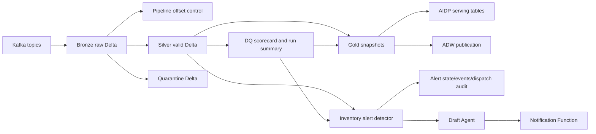

# Architecture

## Processing guarantees

- **Bronze:** Spark Structured Streaming checkpointing plus Kafka topic/partition/offset columns.
- **Silver:** immutable upper bounds per cycle, deterministic event identifiers, and `valid + quarantine = bounded Bronze` reconciliation.
- **Gold:** pinned Silver/DQ Delta versions, deterministic `gold_run_id`, snapshot-first writes, controlled activation, and target count validation.
- **Alert:** pinned Silver version, DQ readiness gate, deterministic transition and dispatch IDs, bootstrap suppression, and retry audit tables.

## Failure boundaries

- Silver offsets advance only after governed writes and count reconciliation succeed.
- Gold serving activation occurs only after snapshot construction and validation.
- ADW publication has a separate status from AIDP snapshot activation.
- Alert transition state and delivery attempts are persisted independently so retries do not recreate events.
